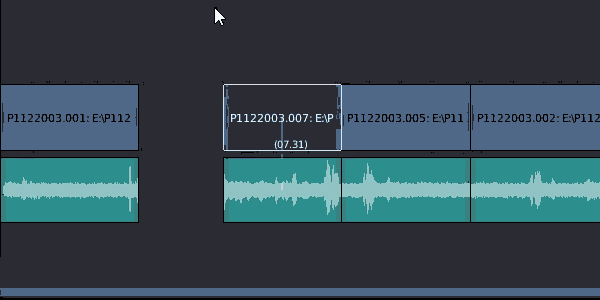
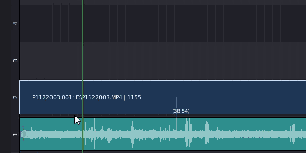
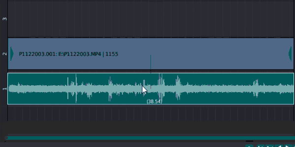
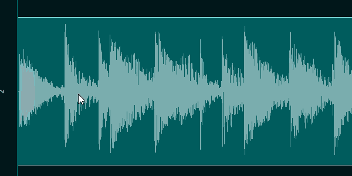
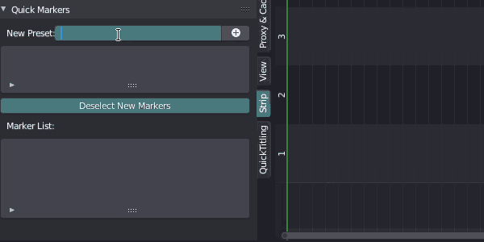
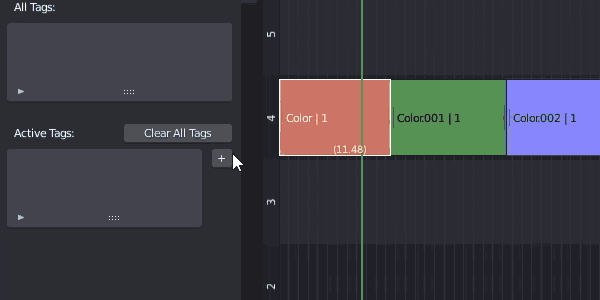
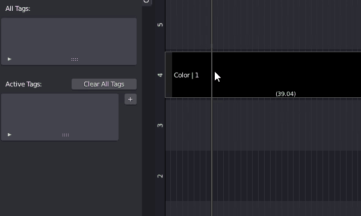
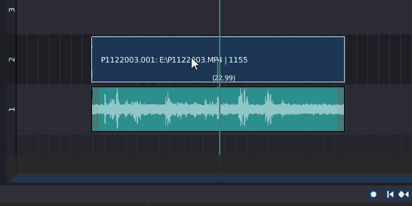

# VSE Quick Functions Addon For Blender 4.4

VSEQF is an overhaul for Blender's VSE that can completely change your workflow.  Designed for quick, mouse and keyboard balanced editing with a focus on real-time feedback.

Development for this script is supported by my multimedia and video production business, [Creative Life Productions](http://www.creativelifeproductions.com)  
But, time spent working on this addon is time I cannot spend earning a living, so if you find this addon useful, consider donating:  

PayPal | Bitcoin
------ | -------
 |    1JnX9ZFsvUaMp13YiQgr9V36EbTE2SA8tz  

Or support me by hiring Creative Life Productions if you have a need for the services provided.

## Installation
* Download the lastest release on the right side of this page at the top - Click the release labeled 'Latest', then click 'Source code (zip)' to download.  
* Open Blender, and from the 'Edit' menu, select 'Preferences'.
* In this new window, click on the "Add-ons" tab at the left.
* Click the 'Install...' button at the top-right of this window.
* Browse to and select the zip file you downloaded, click the 'Install Add-on' button.
* You should now see the addon displayed in the preferences window, click the checkbox next to the name to enable it.
* Now, below the addon information, disable or enable features by clicking the checkbox next to the name of the feature.

## What Can VSEQF Do?
VSEQF is designed to speed up your editing by giving you new tools, and improving the usability of Blender's built-in tools.

#### Timeline Ripple
  
Automatically adjust the position of strips following the current one.  Keep all the following strips in sync while you make cuts, deletes and movements.

Press 'Alt' while grabbing a strip to toggle ripple mode, or press 'Alt-Delete' to ripple delete strips.

#### Strip Cutting
  
New strip cutting menu and panel, quickly trim strips in a variety of time-saving ways.  

Press 'Ctrl-K' to open the cuts menu, or find the 'Quick Cuts' panel in the sequencer sidebar.

#### Fades And Audio Adjustments
  
Add, adjust or remove fades with a single click, and quickly add crossfades between strips.

Press 'F' to add or adjust fades on selected strips, press 'Shift-F' to open the fades menu, or find the 'Quick Fades' panel in the sequencer sidebar.

  
Draw a volume curve directly over an audio strip.

Press 'V' while an audio strip is active.

#### Markers
  
Create marker presets to organize your timeline, jump to any markers in the timeline.

Find the 'Quick Markers' panel in the sequencer sidebar, add marker presets with 'Alt-M'.

#### Tags And Strip Markers
  
Organize strips with tags, select strips based on a tag.

  
Convert tags into strip markers to highlight a section of a strip.

Found in the 'Quick Tags' panel in the sequencer sidebar, or press 'Shift-M' to add and modifiy marker tags.

#### Context Menus
  
More contextual context menus.  Easy access to options that really matter depending on what the mouse is over.

Right click while in left-click mode, or press 'W' or '`'.

#### Zoom Menus
  
Quickly jump to useful zoom sizes, or save and load the best zoom levels for your current project.

Press 'Z' to open the Quick Zooms menu.

#### Three Point Editing
  
Use movie clips like a file bin, import clips and store in/out points based on time indexes, then drop them into the timeline when you want.  

Found in the '3 Point Edit' panel in sidebar in the file browser and movie clip editor areas.

## Sequence Editor Additions
The built-in 'grab', 'select', 'cut', 'delete', 'make meta strip' and 'import' operators have been added to, this enables:

* __'Compact' Edit Panel__

   A new Edit Strip panel for the sequence editor properties area, providing more information in a smaller space than the default panel.  
   This can be enabled or disabled in the addon preferences when the addon is enabled.

* __Ripple Editing__

   While in grab mode, press the alt key to toggle between ripple, ripple-pop, and normal mode.  
   Ripple mode will move all strips after the grabbed strip the same amount.
   Ripple-Pop will allow you to move a strip above and out of a line, automatically closing the gap left behind.  This will only operate when one strip is grabbed.
   Enable the 'Ripple Edit Markers' option to cause markers to behave by ripple rules as well.

* __Edge Grab Improvements__

   When an edge is moved into another strip, the selected strip will be moved up a channel to allow the edge to be moved.  
   The cursor can be automatically snapped to a dragged edge for better adjustment.  

* __Right-Click Context Menus__

   Makes the right-click context menus more contextual, allowing different operations to be performed depending on what is clicked on.  
   Right-click and hold will open context menus when blender is in right-click to select mode.  
   See the QuickContext section for more information.

* __Cut Strip Additions__

   Ripple cuts enabled, press Alt-K to trim and slide one side of the selected strips.  

* __Delete Strip Additions__

   Ripple delete enabled, press Alt-X or Alt-Delete to delete the strip, and move all following strips back to fill the gap.

* __Import Additions__

   Allows setting the length of a single imported image in frames.
   Provides additional options for placing an imported strip on the timeline:  

   * Import At Frame

      Standard import behavior, places new strips at the current frame.

   * Insert At Frame

      Following strip will be moved forward by the length of the imported strip.

   * Cut And Insert At Frame

      All strips at the current frame will be cut and all following strips will be moved forward by the length of the imported strip.

   * Import At End

      Places the imported strips at the end of the timeline.

* __Follow Cursor__

    When activated from the Sequencer header, this will adjust the sequencer viewport to keep the cursor in view when playback is active.

## QuickShortcuts
Enables quick navigation of the timeline using the number pad.  

* __Numpad: Basic Movement And Playback__

| | | |
| :---: | :---: | :---: |
|   | __/__ Cut | __*__  |
| __7__ Cursor back one second | __8__  | __9__ Cursor forward one second |
| __4__ Reverse/slower playback | __5__ Play/pause | __6__ Forward/faster playback |
| __1__ Cursor back one frame | __2__  | __3__ Cursor forward one frame |

* __Ctrl+Numpad: Advanced Movement And Jumps__

| | | |
| :---: | :---: | :---: |
|   | __/__ Cut menu | __*__  |
| __7__ Previous marker | __8__  | __9__ Next marker |
| __4__ Previous strip edge | __5__  | __6__ Next strip edge |
| __1__ Previous keyframe | __2__  | __3__ Next keyframe |

* __Alt+Numpad: Move Selected Strips__

| | | |
| :---: | :---: | :---: |
|   | __/__ Ripple cut | __*__  |
| __7__ Left one second | __8__ Up one channel | __9__ Right one second |
| __4__ Left 1/2 second | __5__ Grab/move | __6__ Right 1/2 second |
| __1__ Left one frame | __2__ Down one channel | __3__ Right one frame |

* __Shift+Numpad: Zoom Timeline__

| | | |
| :---: | :---: | :---: |
|   | __/__ Cut trim | __*__  |
| __7__ Zoom to 10 minutes | __8__ Zoom to selected | __9__ Zoom to all |
| __4__ Zoom to 1 minute | __5__ Zoom to 2 minutes | __6__ Zoom to 5 minutes |
| __1__ Zoom to 2 seconds | __2__ Zoom to 10 seconds | __3__ Zoom to 30 seconds |

## QuickContext
Context menus in the sequencer are more contextual based on what the mouse is over.  
Pressing the 'W' or '`' key on the sequencer will open the menu.  
When Blender is in Left-click mode, the Right-click will open this menu.  

None of the menu options are unique, some are built-in in blender, some are provided by other parts of this script.

Note that all menus start with the undo operator.

The different menu types are:

* __Strips__

   Click on the center of a strip to show a menu providing some settings for the active strip, and selected strips.  

* __Strip Left/Right Handles__

   Click on or near the edge of a strip to pop up a menu allowing for the changing and clearing of the fade in or out.

* __Cursor__

   Click on or near the cursor to show a menu providing some snapping options.

* __Markers__

   Click on or near a marker to show a menu providing some marker operations.

* __Empty Area__

   Click in an empty area of the sequencer to show a menu providing options to add strips, and to zoom the sequencer.

## Quick3Point
__Warning: This is very much alpha, it will likely change quite a bit in future versions, and may even be removed and put into another addon.__  
To use this properly, your screen layout should have a file browser area, a movie clip editor area, and at least one sequencer area.  __This function may not work correctly if all these areas are not present.__  

If strip that shares the same source as a loaded clip is active, that clip will be displayed in the clip editor.  

When a video file is selected in the file browser, a new panel is added to the tools panel, '3 Point Edit'. The 'Import To Clip Editor' button will load the selected video file into the clip editor area.  

The clip editor now has a new panel in the properties panel, '3 Point Edit'.  
To use the following options, the clip does not need to have been loaded via the filebrowser button, any movie clip will work.  

* __Set In/Out__

   A graphic overlay will be created in the clip editor allowing for easy setting of the in and out points of the current clip. Drag the top arrow to set the left ('in') point, and the lower arrow to set the right ('out') point.  
   While in this mode, press the spacebar to play/pause the video.  
   You can drag the playback position at the bottom of the clip editor.  
   Left click anywhere else, or press enter to confirm the changes.  
   Right click or press escape to cancel the changes.  

* __Minutes In, Seconds In, Frames In__

   Set these values to manually adjust the in point for the clip (how much will be removed from the beginning).  
   Adjusting the frames greater than the total frames in a second will increment the seconds, and adjusting the seconds greater than 59 will increment the minutes.  
   If the length is at the maximum possible (end of the clip), it will be reduced as the in point is increased.  

* __Minutes Length, Seconds Length, Frames Length__

   Use these values to set the length of the clip, after the in point.  
   If these values are increased beyond the endpoint of the clip, they will be snapped back to the end.  

* __Import At Cursor__

   Basic import into the sequencer timeline at the current cursor location.  
   No other strips will be moved.  

* __Replace Active Strip__

   If an active strip is in the VSE, it will be deleted and replaced by the imported strip.  
   strips after the replaced one will be moved forward or back to accommodate the length of the new strip.  

* __Insert At Cursor__

   The new strip will be placed at the cursor location, and all trailing strips will be moved forward by the length of the new strip.  

* __Cut Insert At Cursor__

   Similar to Insert At Cursor, but all strips will be cut before inserting, ensuring that nothing overlaps the new strip.  

* __Import At End__

   Places the new strip at the end of the timeline.  

## QuickFades
Enables one-click adding or changing a fade-in or fade-out.  
Also enables one-click crossfading between multiple strips.
Adds a fade adjustment function to provide visual feedback while editing fades directly in the sequencer.

#### Fades Panel
The 'QuickFades' panel provides buttons for setting and removing fades.  
Can be found in the sequence editor properties panel, or by pressing the 'shift-f' key over the sequencer.  
Detected fades will also be shown on the active strip in the timeline, or in the edit strip properties panel.  Fades will be automatically moved if the edges of the strip are changed.
If context menus are enabled, fades can be set by right clicking on the edges of a strip.  

* __Fade Length__

   The target length for fade editing or creating.  
   This can be set to 0 to remove a fade.

* __Set Fadein/Set Fadeout__

   Allows easy adding and changing of fade in/out.  The script will check the curve for any fades already applied to the strip (either manually or by the script), and edit them if found.  
   These buttons can apply the same fade to multiple selected strips at once.

* __Clear Fades__

   Remove fades on all selected strips.

* __Transition Type__

   Selects the type of transition for adding with the following buttons.

* __Crossfade Prev/Next Strip__

   Allows easy adding of transitions between strips.  This will simply find the closest strip to the active strip, and add a transition between them.

* __Smart Cross to Prev/Next__

   Adjust the length of the active strip and the next strip to create a transition of the target fade length.  
   This will also attempt to avoid extending the strips past their end points if possible.

#### Fades Modal Operator
The Modal Fades Operator can be activated by pressing the 'f' key over the sequencer.  
This will apply fades to all selected strips. If only the strip is selected, it will default to applying fades to both edges, if a strip edge is selected, it will default to applying a fade only to that edge.  
To effectively use this operator, you must be able to see the beginning or and of the selected strips.  

While the operator is running:
* Move the mouse up to increase the fades on all edges.
* Move the mouse down to decrease fades on all edges.
* Move the mouse left or right to slide fades left or right.
* Press 'F' or Middle-Mouse to switch fade mode (both edges, only one edge).
* Type in an integer value to set all fades to that value.  

When you are satisfied with the fade positions, left-click or press enter to confirm, or right-click or press escape to cancel.  

## QuickSnaps
A menu for extra cursor and strip snapping functions.

Can be found in the sequence editor 'Strip' menu, or by pressing the 's' key over the sequencer.  
If context menu is enabled, some snaps will be found on right clicking the cursor, and some while right clicking strips.

* __Cursor To Nearest Second__

   Will round the cursor position to the nearest second, based on framerate.

* __Jump To Previous/Next Strip__

   Snap the cursor to the previous or next strip in the timeline.

* __Cursor To Beginning/End Of Active__

   Will move the cursor to the beginning or end of the active strip.

* __Selected To Cursor__

   Snaps the beginning of selected strips to the cursor.  This is the same as the 'shift-s' shortcut in the VSE.

* __Selected Beginning/End To Cursor__

   Moves all selected strips so their beginning/end is at the cursor.

* __Selected To Previous/Next Strip__

   Detects the previous or next strip in the timeline from the active strip, and moves the active strip so it's beginning or end matches the other strip's end or beginning.

* __Jump To Closest/Previous/Next Marker__

    Detects nearby markers and moves the cursor to them.

## QuickZooms
A menu with zoom shortcuts.

Can be found in the sequence editor 'View' menu, or by pressing the 'z' key over the sequencer.  
If context menus are enabled, can be found by right clicking in an open area.

* __Zoom All Strips__

   Zooms the sequencer out to show all strips.

* __Zoom To Timeline__

   Zooms the sequencer to the timeline start and end.

* __Zoom Selected__

   Zooms the sequencer to show the currently selected strip(s).

* __Zoom Cursor__

   Zooms the sequencer to an amount of frames around the cursor.

* __Size__

   How many frames should be shown by using Zoom Cursor. Changing this value will automatically activate Zoom Cursor.

* __Save Current Zoom__

   Saves the current zoom level and view position in the presets menu.

* __Zoom Presets__

   Submenu containing saved presets. Click the 'X' next to each preset to remove it, or click 'Clear All' to erase all presets.

* __Zoom (Time Lengths)__

   Several preset zoom values for convenience.

## QuickMarkers
Add markers to the timeline using name presets, or quickly jump to and remove any marker.  

Can be found in the sequence editor properties panel under 'QuickMarkers', also Alt-M in the sequencer.

* __New Preset__

   Enter a marker title into the text field, and click the + button to add a preset.

* __Place A Marker__

   Click on a marker button once a preset has been added to add a marker with this name at the current cursor location.  
   Adding a marker in the location of a previously existing marker will rename the marker to the marker preset name.

* __Remove A Preset__

   Click the X button next to a preset to remove it.

* __Deselect New Markers__

   With this enabled, newly created markers will be unselected to prevent accidental moving.

* __Marker List__

   Click a marker title to jump the cursor to this marker.  
   Click the X button next to a marker to delete it.

## QuickTags
Create tags, text snippets that can describe strips, and apply them to any strips in the timeline.  All strips with a specific tag can be easily selected with one click.

* __All Tags__

   This list shows all tags on all strips in the timeline.  
   Click a tag to select all strips with that tag.  
   Click the '+' button to add that tag to all selected strips.

* __Active Strip__

   Shows a list of tags for the active strip.
   Click a tag to select all strips with this tag.
   Click the 'X' button to remove the tag from the active strip.

* __Selected Strips__

   Shows a list of tags for all selected strip.
   Click a tag to select all strips with this tag.
   Click the 'X' button to remove the tag from all selected strips.

* __New Tag__

   Type a tag into the field, and press the '+' button to add to all selected strips.  This tag will now show up in the 'All Tags' list as well.

* __Clear Active/Selected Strip Tags__

   Removes all tags from the active or selected strips.

## QuickCuts
Provides a quick interface for basic and advanced cutting and trimming functions.

* __Cut All Strips__

   If enabled, all strips under the cursor (aside from locked strips) will be affected by any button in this panel.  
   If disabled, only selected strips will be affected.

* __Frames To Insert__

   When the 'Cut Insert' function is used, the number of frames here will be inserted.

* __Cut__

   Basic soft cut function, equivalent to the 'K' shortcut in the VSE.

* __Cut Insert__

   Performs a soft cut, then slides all strips following the cut down the timeline by the amount of frames defined in the 'Frames To Insert' variable.

* __UnCut Left/UnCut Right__

   Merges a selected strip with the one to the left or right if they are from the same source file, and have not been slid on the timeline.  
   Useful for 'undoing' an accidental cut.

* __Delete__

   Removes selected strips from the timeline.

* __Ripple Delete__

   Removes selected strips from the timeline, and attempts to remove any empty space left behind.

* __Trim Left/Right__

   Removes any part of the selected strips to the left or right of the cursor.

* __Slide Trim Left/Right__

   Removes any part of the selected strips to the left of the cursor, then slides the remaining strip back or forward to where the original edge was.

* __Ripple Trim Left/Right__

   Trims one side of the selected strips, then slides the strip, and all following strips back to attempt to fill the empty space

* __Timeline To All__

   Sets the start and end points of the VSE timeline to fit all strips loaded in.

* __Timeline To Selected__

   Sets the start and end points of the VSE timeline to fit the currently selected strips. 

* __Start To All/End To All__

   Sets only the start or end of the VSE timeline to fit all strips.

* __Start To Selected/End To Selected__

   Sets only the start or end of the VSE timeline to fit the selected strips.

* __Full Timeline Setup__

   Moves all strips back so they start on frame 1, then sets the start and endpoints of the timeline so they encompass all strips.

# Known Problems
I welcome any help with these problems, if you have an idea on how to fix them, please contact me.

* Sometimes undo pushing breaks, it may add extra undo steps.  Not sure whats going on here...

* Uncut does not work on movieclip type strips, this seems to be a limitation in Blender - there appears to be no way to get the strip's source file.

* Right now the script cannot apply a vertical zoom level, as far as I can tell this is missing functionality in Blenders python api.

* Quick 3point causes recursion errors sometimes when adjusting in/out.

# Future Possibilities
These are things I want to add, but I don't yet know how to, or have not yet had the time to implement.

* Ripple insert (opposite of ripple pop).  Not entirely sure how to code this yet, but I want it!

* Copy/paste wrapper that will copy strip animation data.

* Add maximize volume option for strip, maybe add a compressor via animations?
